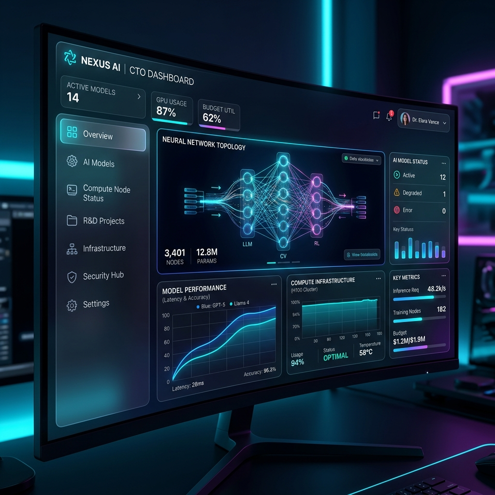
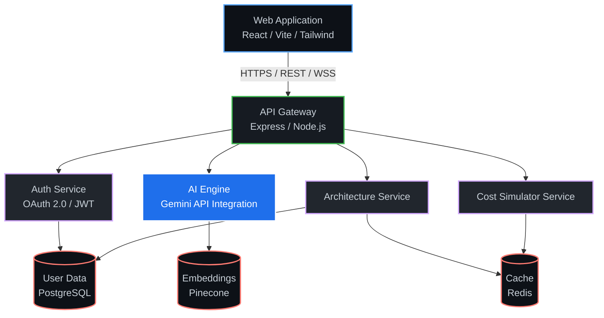
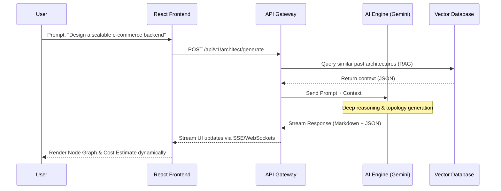
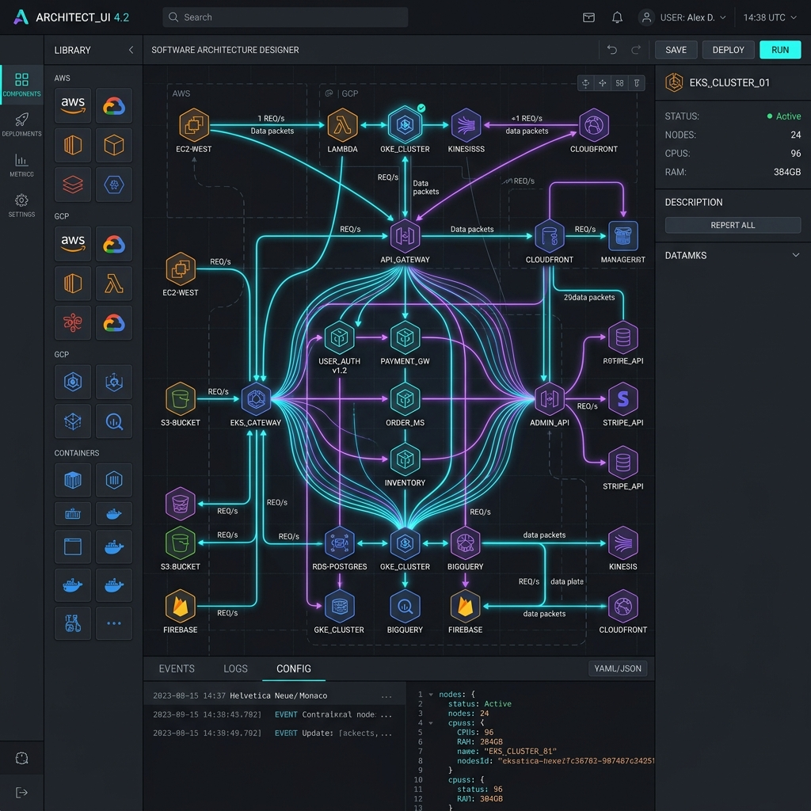
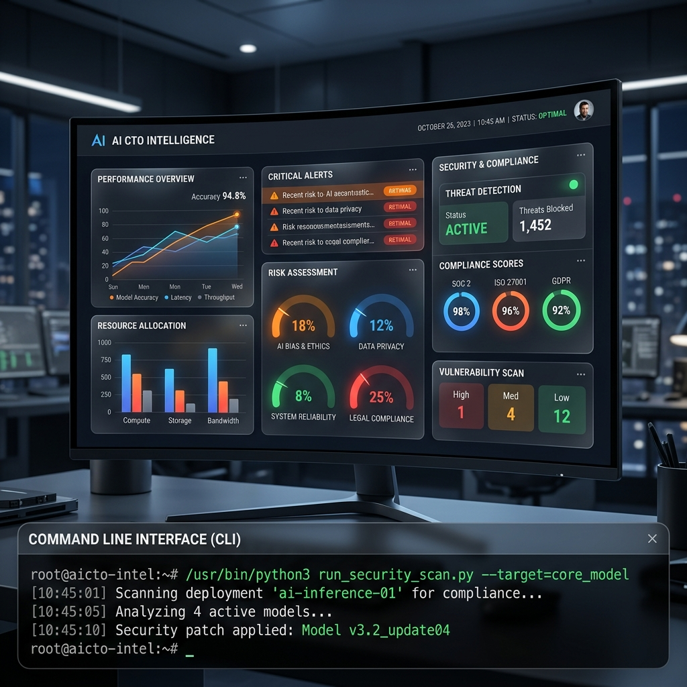
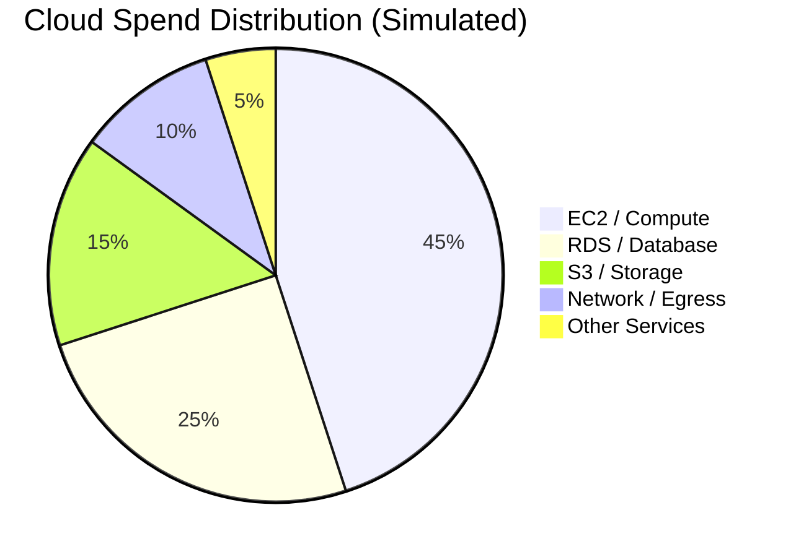
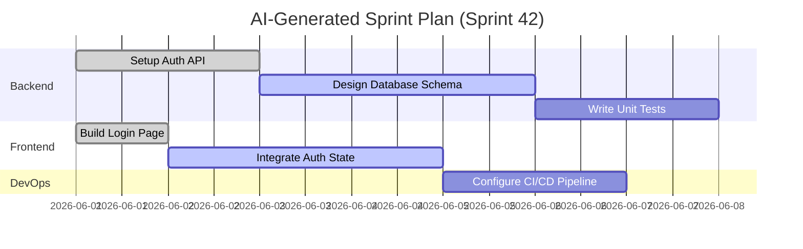

<div align="center">
  <h1>🚀 AI CTO Platform</h1>
  <p><strong>Your Intelligent, Autonomous Chief Technology Officer</strong></p>
  
</div>

<div align="center">
  <br />
  <a href="#features">Features</a>
  <span>&nbsp;&nbsp;•&nbsp;&nbsp;</span>
  <a href="#architecture">Architecture</a>
  <span>&nbsp;&nbsp;•&nbsp;&nbsp;</span>
  <a href="#modules">Modules</a>
  <span>&nbsp;&nbsp;•&nbsp;&nbsp;</span>
  <a href="#installation">Installation</a>
  <span>&nbsp;&nbsp;•&nbsp;&nbsp;</span>
  <a href="#deployment">Deployment</a>
  <br />
</div>

---

## 📖 Table of Contents

1. [Overview](#overview)
2. [Why AI CTO?](#why-ai-cto)
3. [Core Features](#core-features)
4. [System Architecture](#system-architecture)
5. [Data Flow & Integrations](#data-flow--integrations)
6. [Security & Compliance](#security--compliance)
7. [Module Deep Dives](#module-deep-dives)
    - [Command Center Dashboard](#command-center-dashboard)
    - [Architecture Designer](#architecture-designer)
    - [CTO Intelligence Hub](#cto-intelligence-hub)
    - [Cost Simulator](#cost-simulator)
    - [Engineering Corps](#engineering-corps)
    - [Sprint Planner](#sprint-planner)
    - [Requirements Studio](#requirements-studio)
8. [Technology Stack](#technology-stack)
9. [Project Structure](#project-structure)
10. [Getting Started](#getting-started)
    - [Prerequisites](#prerequisites)
    - [Installation](#installation-1)
    - [Environment Variables](#environment-variables)
11. [Usage Guide](#usage-guide)
12. [API Reference](#api-reference)
    - [Authentication](#authentication)
    - [Endpoints](#endpoints)
    - [Status Codes](#status-codes)
13. [Deployment Strategies](#deployment-strategies)
14. [Testing & QA](#testing--qa)
15. [Troubleshooting & FAQ](#troubleshooting--faq)
16. [Contributing](#contributing)
17. [Code of Conduct](#code-of-conduct)
18. [License](#license)
19. [Acknowledgments](#acknowledgments)

---

## 🌟 Overview

The **AI CTO Platform** is a revolutionary open-source project designed to democratize technical leadership. Startups and mid-sized companies often lack the resources to hire experienced Chief Technology Officers (CTOs). This platform bridges that gap by providing a highly capable, autonomous AI agent that performs the duties of a world-class technical leader.

Powered by Google's Gemini Pro and an array of sophisticated local models, the AI CTO can design architectures, write code, manage infrastructure, review security postures, and even simulate cloud costs. It acts as a co-pilot for engineering teams and a technical advisor for non-technical founders.

### The Mission
Our mission is to empower creators, founders, and developers with enterprise-grade technical decision-making capabilities, accessible anywhere, anytime. We believe that access to high-level technical strategy should not be gated by massive budgets. 

Through semantic understanding, real-time code analysis, and predictive cloud modeling, the AI CTO takes the guesswork out of software engineering.

---

## 💡 Why AI CTO?

In the modern software development lifecycle, decision fatigue is a critical bottleneck. 
- **Startups:** Need fast, scalable, and cost-effective architectural decisions without the budget for a $200k+ CTO.
- **Enterprise Teams:** Need a rapid prototyping and validation tool that can simulate complex architectures before writing a single line of code.
- **Solo Developers:** Need a reliable partner to bounce ideas off, debug complex deployment pipelines, and ensure security best practices.

The AI CTO Platform solves these problems through an intuitive, cinematic user interface that feels less like a dashboard and more like a command center from the future. 

### Tangible Benefits
1. **Reduce Cloud Spend:** Avoid over-provisioning with accurate cost simulations.
2. **Accelerate Time-to-Market:** Generate boilerplate and infrastructure code in seconds.
3. **Minimize Technical Debt:** Get instant feedback on anti-patterns and messy code structures.
4. **Enhance Security:** Catch vulnerabilities before they reach production.

---

## ✨ Core Features

| Feature Category | Description | Status |
|------------------|-------------|--------|
| **Architecture** | Generate, visualize, and export cloud architectures (AWS/GCP/Azure) using a visual node editor. | 🟢 Active |
| **Code Review** | Automated code reviews with semantic understanding, security vulnerability detection, and performance tips. | 🟢 Active |
| **Cost Simulator** | Real-time prediction of cloud costs based on your selected architecture and expected traffic. | 🟢 Active |
| **Security Center** | Continuous monitoring, vulnerability scanning (OWASP Top 10), and automated patching recommendations. | 🟡 Beta |
| **Sprint Planner** | AI-driven sprint planning, velocity tracking, and automatic ticket generation. | 🟡 Beta |
| **API Explorer** | Centralized hub to manage, test, and document all microservice APIs automatically. | 🟢 Active |
| **Requirements** | Convert vague business ideas into strict, technical Product Requirement Documents (PRDs). | 🟢 Active |
| **Database Design**| Visual schema builder that auto-generates SQL migrations and Prisma schemas. | 🟢 Active |
| **Engineering Corps** | Delegate tasks to specialized sub-agents (e.g., DevOps Agent, Frontend Agent, DB Admin). | 🔴 Alpha |

---

## 🏗️ System Architecture

The AI CTO Platform is built on a scalable, modular micro-frontend and microservices architecture. 



### Explanation of Architecture
1. **Client Tier:** A highly responsive React frontend using Vite for lightning-fast HMR. The UI is built with Tailwind CSS, Framer Motion for animations, and React Three Fiber for 3D cinematic elements.
2. **API Gateway:** Acts as the central orchestrator, routing requests, handling rate limiting, and ensuring payload validation.
3. **Services:** 
   - **Auth Service:** Manages user sessions, roles (e.g., Admin, Developer, Viewer), and API key issuance.
   - **AI Engine:** The core brain, interfacing with Google's Gemini models for deep reasoning and code generation.
   - **Architecture Service:** Handles the CRUD operations for saved system blueprints.
4. **Data Layer:** PostgreSQL for relational data, Redis for transient caching of AI responses, and Pinecone for vector embeddings (used in RAG for code context).

---

## 🔄 Data Flow & Integrations

The flow of data through the AI CTO platform is designed for minimal latency, ensuring that the AI feels responsive and conversational. This diagram illustrates the data flow when generating a new architecture.



---

## 🔒 Security & Compliance

Security is paramount when an AI has access to your codebase and infrastructure. The AI CTO Platform implements a defense-in-depth strategy.

```mermaid
flowchart LR
    subgraph Security Layers
        A[WAF / Cloudflare] --> B[API Gateway]
        B --> C[Rate Limiter]
        C --> D[Auth Middleware]
        D --> E[Payload Sanitizer]
        E --> F[Service Execution]
    end
    
    subgraph AI Safety
        F --> G[Prompt Injection Filter]
        G --> H[LLM Execution]
        H --> I[Output Sanitizer]
    end
    
    style Security Layers fill:#1a1a1a,stroke:#ff5555,stroke-width:2px
    style AI Safety fill:#1a1a1a,stroke:#5555ff,stroke-width:2px
```



### Key Security Implementations
- **Zero Trust Architecture:** Every internal service request must be authenticated, regardless of origin.
- **Data Encryption:** All data at rest is encrypted using AES-256. Data in transit uses TLS 1.3.
- **Secrets Management:** Environment variables and API keys are never stored in plain text. They are managed via secure vaults.
- **AI Output Sanitization:** The AI's generated code and CLI commands are strictly sandboxed and linted for malicious patterns before being presented to the user.
- **Role-Based Access Control (RBAC):** Granular permissions ensuring that junior developers cannot approve critical architectural changes without Senior/Admin override.

---

## 🧩 Module Deep Dives

### Command Center Dashboard
The command center is the beating heart of the platform. It provides a real-time overview of your entire technical organization.

<div align="center">
  
  <p><em>The Command Center displaying system health, active sprint metrics, and AI recommendations.</em></p>
</div>

**Capabilities:**
- **System Health Monitoring:** Integrates with Datadog/New Relic to show live uptime and error rates.
- **Action Items:** The AI proactively generates tasks (e.g., "Upgrade React to v18 to patch vulnerability X").
- **Global Search:** Semantic search across all code, documentation, and past architectural decisions.

### Architecture Designer
A visual node-based editor that allows you to drag, drop, and connect cloud services. The AI acts as your co-pilot, suggesting better configurations or warning you of anti-patterns.

<div align="center">
  
  <p><em>Designing a microservices topology with real-time AI validation.</em></p>
</div>

**Capabilities:**
- **Auto-Layout:** Instantly organizes messy diagrams.
- **Export to Terraform/Pulumi:** With one click, the visual diagram is compiled into production-ready Infrastructure-as-Code (IaC).
- **Multi-Cloud Support:** Visually mix and match AWS, GCP, and Azure components.
- **Disaster Recovery Testing:** Simulate region outages and see how the architecture responds.

### CTO Intelligence Hub
The brain of the operation. This module provides deep analytical insights into your engineering team's velocity, risk factors, and technical debt.

<div align="center">
  
  <p><em>Analyzing security compliance, technical debt, and team velocity.</em></p>
</div>

**Capabilities:**
- **Risk Assessment:** Scans your dependency tree for known vulnerabilities.
- **Tech Debt Quantification:** The AI reads your codebase and estimates the monetary cost of your technical debt.
- **Compliance Tracking:** Ensures your architecture meets SOC2, HIPAA, or GDPR requirements.
- **Code Quality Metrics:** Tracks cyclomatic complexity, test coverage, and duplication across repositories.

### Cost Simulator
Before you deploy, the AI CTO simulates the exact monthly cost of your infrastructure based on projected MAU (Monthly Active Users) and payload sizes.



**Capabilities:**
- **Instance Sizing:** Recommends optimal instance sizes based on load testing data.
- **Reserved Instances:** Suggests purchasing reserved instances to save money over 1-3 year terms.
- **Anomaly Detection:** Alerts you if a code change is expected to significantly increase cloud costs.

### Sprint Planner
An intelligent kanban board that plans sprints for you.



### Engineering Corps
Why stop at a CTO? The platform allows you to spawn sub-agents to do the grunt work.
- **Frontend Agent:** Translates Figma designs into React components.
- **Backend Agent:** Writes API endpoints, database migrations, and unit tests.
- **DevOps Agent:** Configures CI/CD pipelines in GitHub Actions and manages Kubernetes clusters.

### Requirements Studio
The Requirements Studio is where vague ideas become concrete technical specifications. The AI interviews the user, gathers requirements, and generates a strict Product Requirement Document (PRD).

**Outputs:**
- User Stories (BDD format)
- Acceptance Criteria
- Non-functional requirements (latency, uptime)
- Edge cases and failure modes

---

## 🛠️ Technology Stack

The platform is built using the most modern, battle-tested technologies available to ensure a responsive, maintainable, and scalable application.

### Frontend
| Technology | Purpose |
|------------|---------|
| **React 18** | Core UI library for building component-driven interfaces. |
| **Vite** | Blazing fast build tool and development server. |
| **Tailwind CSS** | Utility-first CSS framework for rapid styling. |
| **Zustand** | Lightweight, fast state management without boilerplate. |
| **Framer Motion** | For complex, fluid animations and page transitions. |
| **React Three Fiber** | For rendering 3D cinematic models and holographic elements. |
| **Lucide React** | Beautiful, consistent icon set. |
| **React Flow** | For building the node-based Architecture Designer and data flow maps. |

### Backend / AI
| Technology | Purpose |
|------------|---------|
| **Node.js / Express** | Fast, asynchronous backend server routing logic. |
| **Google Gemini API** | The core LLM powering the CTO intelligence, code review, and generation. |
| **PostgreSQL** | Relational data storage for user accounts, saved architectures, and sprint data. |
| **Redis** | High-speed caching layer to reduce latency for repeated AI requests. |
| **TypeScript** | End-to-end type safety across the entire stack, reducing runtime errors. |

---

## 📂 Project Structure

A clean, scalable directory structure is essential for a project of this magnitude. Our structure is modular by design, allowing multiple teams to work in parallel.

```text
ai-cto-platform/
├── .env.example                # Example environment variables
├── package.json                # Project dependencies and scripts
├── tsconfig.json               # TypeScript configuration
├── vite.config.ts              # Vite bundler configuration
├── tailwind.config.ts          # Tailwind styling rules
├── postcss.config.js           # PostCSS config for Tailwind
├── public/                     # Static assets that bypass the bundler
│   ├── images/                 # Generated UI mockups, logos, and icons
│   └── models/                 # 3D assets for cinematic mode
└── src/                        # Main source code
    ├── components/             # Reusable React components
    │   ├── ui/                 # Atomic UI components (Buttons, Inputs, Dialogs)
    │   ├── cinematic/          # 3D and complex animation components (Three.js)
    │   └── layout/             # Structural components (Sidebar, Header, Navigation)
    ├── pages/                  # Route-level components
    │   ├── command-center/     # The core dashboard and its sub-modules (e.g., DatabaseDesigner.tsx)
    │   ├── auth/               # Login, Signup, Password Reset, MFA
    │   └── landing/            # Public facing marketing pages
    ├── stores/                 # Zustand state management slices
    ├── lib/                    # Utility functions, API clients, and helpers
    ├── types/                  # Global TypeScript interfaces and type definitions
    ├── App.tsx                 # Main application router and context providers
    ├── main.tsx                # React entry point, DOM attachment
    └── index.css               # Global CSS, Tailwind directives, and custom variables
```

---

## 🚀 Getting Started

Follow these instructions to get a copy of the project up and running on your local machine for development and testing purposes.

### Prerequisites

You need the following installed on your system to run the platform locally:
- **Node.js** (v18.0.0 or higher)
- **npm** (v9.0.0 or higher) or **yarn** or **pnpm**
- **Git**
- A **Google Gemini API Key** (or another supported LLM provider)

### Installation

1. **Clone the repository**
   First, clone the repository to your local machine using Git.
   ```bash
   git clone https://github.com/COZYkrish/CTO.ai---An-AI-powered-Chief-Technology-Officer.git
   cd CTO.ai---An-AI-powered-Chief-Technology-Officer
   ```

2. **Install dependencies**
   Install all required NPM packages. This might take a minute as it downloads React, Three.js, and Framer Motion.
   Using npm:
   ```bash
   npm install
   ```

3. **Set up environment variables**
   Copy the example environment file to create your local configuration.
   ```bash
   cp .env.example .env
   ```
   Open the newly created `.env` file and fill in your API keys.

4. **Start the development server**
   Launch the Vite development server.
   ```bash
   npm run dev
   ```
   The application will be available at `http://localhost:5173`. Open this URL in your browser.

### Environment Variables

To fully utilize the AI features, you must provide the necessary API keys. Here is an example of what your `.env` should look like:

```env
# AI Models
VITE_GEMINI_API_KEY=your_google_gemini_api_key_here

# API Configuration
VITE_API_BASE_URL=http://localhost:3000/api
VITE_ENVIRONMENT=development

# Feature Flags
VITE_ENABLE_CINEMATIC_MODE=true
VITE_ENABLE_EXPERIMENTAL_AGENTS=false
```

---

## 📖 Usage Guide

Once the application is running, follow this standard workflow to get the most out of the AI CTO:

1. **Initialize the System:** Navigate to the `InitializeSystem.tsx` view (usually accessible via the sidebar). Input your project requirements. The AI will ask you questions about your target audience, expected scale, and preferred stack.
2. **Review Architecture:** Go to the `ArchitectureDesigner.tsx` to see the generated cloud topology. You can manually tweak nodes, add databases, or remove unnecessary microservices by dragging and dropping.
3. **Analyze Costs:** Jump to the `CostSimulator.tsx` to ensure the designed architecture fits your budget. Adjust parameters like traffic volume and data storage to see real-time cost fluctuations.
4. **Generate Code / IaC:** Once satisfied with the architecture, use the export functions to generate Dockerfiles, Kubernetes manifests, Terraform scripts, or raw source code boilerplates. The AI will provide download links for these assets.
5. **Monitor Health:** Check back in the `CommandCenter` daily to view simulated or real metrics, review AI-generated pull request summaries, and check for security alerts.

---

## 🔌 API Reference

The AI CTO Platform exposes a RESTful API for headless integration. This allows you to hook up your CI/CD pipelines directly to the AI for automated reviews, or build custom dashboards.

### Authentication
All protected API requests require a Bearer token in the `Authorization` header. You can generate a Personal Access Token (PAT) from your user settings.
```http
Authorization: Bearer <your_access_token>
```

### Endpoints

#### `POST /api/v1/analyze/code`
Analyzes a snippet of code for security vulnerabilities, performance bottlenecks, and adherence to best practices.

**Request Body:**
```json
{
  "language": "typescript",
  "code": "function processPayment(amount, user) { db.query('UPDATE users SET balance = balance - ' + amount); }",
  "context": "Payment processing function."
}
```

**Response (200 OK):**
```json
{
  "status": "success",
  "analysis": {
    "security": "Critical: SQL Injection vulnerability detected in db.query concatenation.",
    "performance": "Adequate, but lacking transaction control.",
    "suggestions": [
      "Use parameterized queries instead of string concatenation.",
      "Wrap the database update in a transaction.",
      "Add input validation for the 'amount' parameter."
    ]
  }
}
```

#### `GET /api/v1/architecture/:id`
Retrieves a saved architectural blueprint by ID.

**Response (200 OK):**
```json
{
  "id": "arch_123",
  "name": "E-Commerce Backend",
  "created_at": "2026-06-11T12:00:00Z",
  "nodes": [
    { "id": "n1", "type": "aws_lambda", "label": "Checkout Service", "cost_estimate": 12.50 },
    { "id": "n2", "type": "aws_dynamodb", "label": "Orders Table", "cost_estimate": 45.00 }
  ],
  "edges": [
    { "source": "n1", "target": "n2", "protocol": "HTTPS" }
  ]
}
```

### Status Codes
The API uses standard HTTP status codes to indicate the success or failure of requests.

| Code | Status | Description |
|------|--------|-------------|
| **200** | OK | The request was successful. |
| **201** | Created | A new resource (like an architecture blueprint) was successfully created. |
| **400** | Bad Request | The request was invalid or cannot be otherwise served. Check your payload. |
| **401** | Unauthorized | Authentication failed or user does not have permissions. |
| **403** | Forbidden | The authenticated user does not have permission to access the requested resource. |
| **404** | Not Found | The requested resource could not be found. |
| **429** | Too Many Requests | Rate limit exceeded. Please back off and try again later. |
| **500** | Internal Server Error | An error occurred on the server. The AI Engine might be down. |

---

## 🌍 Deployment Strategies

The platform can be deployed in multiple ways depending on your organization's scale and security requirements.

### 1. Vercel (Recommended for Frontend)
Since the frontend is built with Vite and React, it is perfectly suited for Vercel's Edge Network.
1. Push your code to a GitHub repository.
2. Import the project in the Vercel dashboard.
3. Set the Framework Preset to Vite. The Build Command should be `npm run build` and Output Directory to `dist`.
4. Add your `.env` variables in the Vercel Environment Variables settings.
5. Click Deploy!

### 2. Docker (Self-Hosted)
For total control, on-premise deployments, or integrating into an existing microservices cluster, you can containerize the application.

**Dockerfile Example:**
```dockerfile
# Build Stage
FROM node:18-alpine AS builder
WORKDIR /app
COPY package*.json ./
RUN npm install --frozen-lockfile
COPY . .
RUN npm run build

# Production Stage
FROM nginx:alpine
# Copy built assets from builder
COPY --from=builder /app/dist /usr/share/nginx/html
# Copy custom Nginx configuration if needed
# COPY nginx.conf /etc/nginx/conf.d/default.conf
EXPOSE 80
CMD ["nginx", "-g", "daemon off;"]
```

Build and run the container locally:
```bash
docker build -t ai-cto-platform .
docker run -p 8080:80 -d ai-cto-platform
```
Access the application at `http://localhost:8080`.

### 3. Kubernetes
For enterprise deployments requiring high availability and auto-scaling, helm charts and Kubernetes manifests are provided in the `/k8s` directory (coming soon). This deployment strategy handles load balancing, secret management, and rolling updates seamlessly.

---

## 🧪 Testing & QA

Quality assurance is automated using a combination of unit tests, integration tests, and End-to-End (E2E) tests. We maintain a strict >80% code coverage requirement for all new PRs.

- **Unit Testing:** Powered by Vitest and React Testing Library. This covers individual components, custom hooks, and utility functions.
  ```bash
  npm run test:unit
  ```
- **E2E Testing:** Powered by Cypress or Playwright. These tests simulate user interactions across the entire platform, ensuring critical paths (like generating an architecture) work flawlessly.
  ```bash
  npm run test:e2e
  ```
- **Linting & Formatting:** ESLint and Prettier enforce code quality and consistent styling.
  ```bash
  npm run lint
  npm run format
  ```
- **Type Checking:** Ensure there are no TypeScript errors before committing.
  ```bash
  npm run type-check
  ```

---

## ❓ Troubleshooting & FAQ

**Q: The AI is giving generic or inaccurate architectural advice. What's wrong?**
A: Ensure your `VITE_GEMINI_API_KEY` is set correctly. If you are using a free tier API key, you might be hitting rate limits which causes the application to fallback to simpler, cached responses. Check the network tab in your browser for 429 errors.

**Q: The 3D cinematic elements are causing performance issues on my machine.**
A: You can disable the cinematic mode by setting `VITE_ENABLE_CINEMATIC_MODE=false` in your `.env` file, or by toggling "Performance Mode" in the platform settings UI.

**Q: Node modules fail to install with a peer dependency error.**
A: The project uses strict dependency resolutions. Ensure you are using npm version 9+. If issues persist, try running `npm install --legacy-peer-deps`, although this is not recommended for production builds.

**Q: I get a blank screen when loading the application.**
A: Check your browser console. This is usually caused by a missing environment variable or an API failure during the initial hydration phase. Ensure your backend services are reachable.

---

## 🤝 Contributing

We welcome contributions from the community! Whether you're fixing a bug, adding a feature, improving documentation, or designing new UI components, your help is appreciated. The AI CTO Platform thrives on diverse perspectives.

### Contribution Workflow
1. **Fork** the repository to your own GitHub account.
2. **Clone** your fork locally.
3. **Create a branch** for your feature or bugfix (`git checkout -b feature/AmazingFeature`).
4. **Make your changes**. Ensure you follow the coding standards.
5. **Commit** your changes with descriptive messages (`git commit -m 'Add AmazingFeature for enhanced security scanning'`).
6. **Push** to your branch (`git push origin feature/AmazingFeature`).
7. **Open a Pull Request** against the `main` branch of the original repository. Provide a clear description of your changes and why they are necessary.

### Development Guidelines
- **TypeScript:** Ensure all new components, functions, and API responses are strictly typed using TypeScript. Avoid using `any`.
- **Testing:** Write unit tests for all complex business logic and new React components.
- **Styling:** Follow the existing Tailwind CSS naming conventions. Utilize the design system variables defined in `tailwind.config.ts` rather than hardcoding colors or spacing.
- **AI Prompts:** If you are modifying the internal prompts sent to the LLM, please run the AI benchmark suite (if available) to ensure no regression in output quality.

---

## 📜 Code of Conduct

We are committed to fostering a welcoming, inclusive, and inspiring community for all. 
Please read our [Code of Conduct](./CODE_OF_CONDUCT.md) before participating in our repository, issue tracker, or community spaces (like Discord or Slack). Harassment, discrimination, and exclusionary behavior will not be tolerated. We want everyone to feel safe contributing to the AI CTO Platform.

---

## 📄 License

This project is licensed under the MIT License - see the [LICENSE](LICENSE) file for details.
You are free to use, modify, and distribute this software for both personal and commercial projects. We only ask that you attribute the original creators where appropriate.

---

## 🙏 Acknowledgments

The development of the AI CTO Platform would not be possible without the incredible tools and communities that power the modern web:

- **Google DeepMind / Google Cloud:** For creating and providing access to the incredibly powerful Gemini Pro models, which form the brain of this project.
- **Radix UI:** For providing highly accessible, unstyled UI primitives that serve as the foundation for our components.
- **Zustand:** For making global state management a breeze without the boilerplate of Redux.
- **Three.js & React Three Fiber:** For making the web a 3D canvas and allowing us to build a truly cinematic user experience.
- **The Open Source Community:** For the continuous support, bug reports, feature requests, and inspiration.

---

<div align="center">
  <p>Built with ❤️ by the AI CTO Engineering Team and open-source contributors worldwide.</p>
  <p><em>"Code is temporary, architecture is forever." - The AI CTO</em></p>
  
  <br/>
  
  <a href="https://github.com/COZYkrish/CTO.ai---An-AI-powered-Chief-Technology-Officer/stargazers"></a>
  <a href="https://github.com/COZYkrish/CTO.ai---An-AI-powered-Chief-Technology-Officer/network/members"></a>
</div>